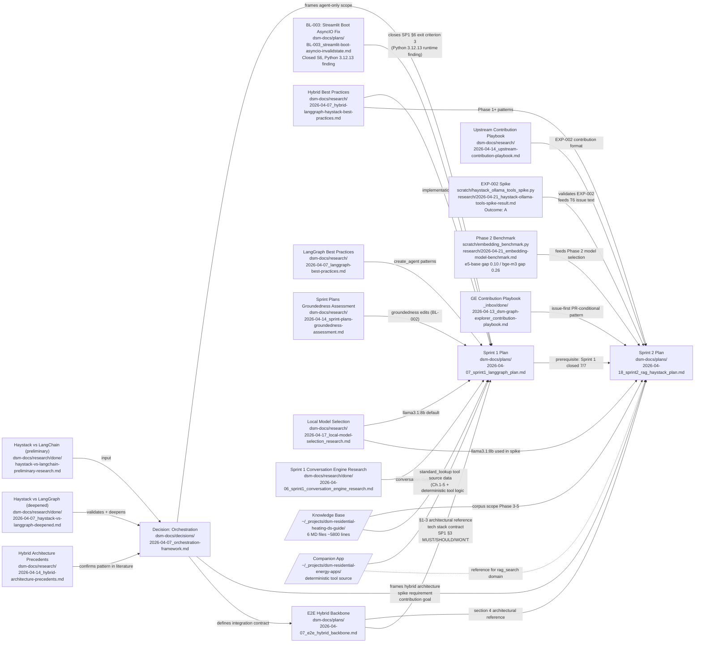

# DSM Provenance DAG — Heating Systems Conversational AI

**Created:** 2026-04-22
**Status:** Living document — append as new artifacts join the project
**Scope:** Sprints 1 and 2 fully mapped (BL-004 closed 2026-04-29).
**Location rationale:** `dsm-docs/plans/` — the DAG exists to support and explain the plans;
it is the connective tissue between plans and their justifying artifacts.

---

## Overview

This document makes explicit the dependency network (DAG) between plans and
all artifacts that support, justify, or validate them: research files,
decisions, experiments, external resources, and backlog items. It answers
the question "why does this plan look the way it does, and where did each
major design choice come from?" without requiring the reader to already
know which documents to look for.

**Reading the DAG:** plans are the backbone (bold border in Mermaid). Every
other node is a supporting artifact. Edges point from supporting artifact
to the plan or decision they feed. External nodes (outside this repo) are
shown with dashed borders.

---

## Visual DAG (Mermaid)

---

## Node Registry (full paths + descriptions)

### Plans (backbone)

| ID | File | Description |
|----|------|-------------|
| SP1 | [dsm-docs/plans/2026-04-07_sprint1_langgraph_plan.md](2026-04-07_sprint1_langgraph_plan.md) | Sprint 1: LangGraph agent + deterministic tools + Streamlit UI. Closed 7/7. |
| SP2 | [dsm-docs/plans/2026-04-18_sprint2_rag_haystack_plan.md](2026-04-18_sprint2_rag_haystack_plan.md) | Sprint 2: Haystack RAG subsystem + `rag_search` tool + upstream contribution. |
| BB | [dsm-docs/plans/2026-04-07_e2e_hybrid_backbone.md](2026-04-07_e2e_hybrid_backbone.md) | End-to-end hybrid architecture backbone. Section 4 is the Sprint 2 architectural reference. |
| BL_003 | [dsm-docs/plans/BL-003_streamlit-boot-asyncio-invalidstate.md](BL-003_streamlit-boot-asyncio-invalidstate.md) | Streamlit boot `asyncio.InvalidStateError` bug fix. Closed Session 6. Empirical finding: `.venv` recreated on Python 3.12.13 (was 3.11.0rc1) resolves the boot. Closes SP1 §6 exit criterion 3. |

### Decisions

| ID | File | Description |
|----|------|-------------|
| DEC_ORCH | [dsm-docs/decisions/2026-04-07_orchestration-framework.md](../decisions/2026-04-07_orchestration-framework.md) | Hybrid LangGraph + Haystack architecture. Frames Sprint 1 (agent-only) and Sprint 2 (RAG subsystem behind `@tool` boundary). Validation criteria span all 3 sprints. |

### Research

| ID | File | Description | Status |
|----|------|-------------|--------|
| RES_PRELIM | [dsm-docs/research/done/haystack-vs-langchain-preliminary-research.md](../research/done/haystack-vs-langchain-preliminary-research.md) | Initial framework comparison. Input to orchestration decision. | Done |
| RES_DEEP | [dsm-docs/research/done/2026-04-07_haystack-vs-langgraph-deepened.md](../research/done/2026-04-07_haystack-vs-langgraph-deepened.md) | Deepened comparison that revealed Haystack Ollama tool-calling gap. Validates orchestration decision. | Done |
| RES_CONVO | [dsm-docs/research/done/2026-04-06_sprint1_conversation_engine_research.md](../research/done/2026-04-06_sprint1_conversation_engine_research.md) | Sprint 1 grounding research: knowledge base + companion app inventory, tools-design rationale (heating_curve, standard_lookup, unit_converter), ReAct architecture decision (replacing the preliminary 4-node pipeline), bilingual MUST elevation, Streamlit minimum-viable UI scope, two-tier testing strategy. | Done |
| RES_HYBP | [dsm-docs/research/2026-04-07_hybrid-langgraph-haystack-best-practices.md](../research/2026-04-07_hybrid-langgraph-haystack-best-practices.md) | Implementation patterns for hybrid architecture. Feeds Sprint 1 and Sprint 2. | Active |
| RES_LGBP | [dsm-docs/research/2026-04-07_langgraph-best-practices.md](../research/2026-04-07_langgraph-best-practices.md) | `create_agent` patterns, memory, tool registration. Feeds Sprint 1. | Active |
| RES_PREC | [dsm-docs/research/2026-04-14_hybrid-architecture-precedents.md](../research/2026-04-14_hybrid-architecture-precedents.md) | Literature evidence that hybrid pattern exists (Funderburk 2025, Panta 2026). Validates orchestration decision (BL-001). | Active |
| RES_GRNDS | [dsm-docs/research/2026-04-14_sprint-plans-groundedness-assessment.md](../research/2026-04-14_sprint-plans-groundedness-assessment.md) | Groundedness audit of Sprint 1 plan. Edits applied via BL-002. | Active |
| RES_CONTRIB | [dsm-docs/research/2026-04-14_upstream-contribution-playbook.md](../research/2026-04-14_upstream-contribution-playbook.md) | GE contribution playbook adapted for this project. Feeds Sprint 2 EXP-002 contribution format. | Active |
| RES_MODEL | [dsm-docs/research/2026-04-17_local-model-selection_research.md](../research/2026-04-17_local-model-selection_research.md) | Evidence-based selection of `llama3.1:8b` as default model. Feeds Sprint 1 + Sprint 2 spike. | Active |
| EXP_SPIKE | [dsm-docs/research/2026-04-21_haystack-ollama-tools-spike-result.md](../research/2026-04-21_haystack-ollama-tools-spike-result.md) | EXP-002 result: Outcome A (full tool-calling round-trip confirmed). Validates hybrid architecture. Script: `scratch/haystack_ollama_tools_spike.py`. | Done |
| EXP_BENCH | [dsm-docs/research/2026-04-21_embedding-model-benchmark.md](../research/2026-04-21_embedding-model-benchmark.md) | Phase 2 micro-benchmark: e5-base (gap 0.10, 20.7/s) vs bge-m3 (gap 0.26, 6.4/s). Model selection pending Opus turn. Script: `scratch/embedding_benchmark.py`. | Pending decision |

### Inbox / Playbooks

| ID | File | Description |
|----|------|-------------|
| INB_GE | [_inbox/done/2026-04-13_dsm-graph-explorer_contribution-playbook.md](../../_inbox/done/2026-04-13_dsm-graph-explorer_contribution-playbook.md) | Graph Explorer contribution playbook (issue-first, PR-conditional). Pattern adopted for Sprint 2 EXP-002. |

### External Resources (outside this repo)

| ID | Path | Description |
|----|------|-------------|
| EXT_KB | `/home/berto/_projects/dsm-residential-heating-ds-guide/` | Knowledge base: 6 MD files, ~5,800 lines. German heating standards, ML/DS applications, MLOps. Sprint 2 corpus (read-only). |
| EXT_APPS | `/home/berto/_projects/dsm-residential-energy-apps/` | Companion Streamlit app (heating curve simulator, DIN EN 12831, VDI 6030). Source for Sprint 1 deterministic tool logic; reference for `rag_search` domain. |

---

## Edge Registry

| From | To | Relationship |
|------|----|-------------|
| RES_PRELIM | DEC_ORCH | Input: initial framework comparison prompted the decision |
| RES_DEEP | DEC_ORCH | Validates: revealed Haystack Ollama tool-calling gap; confirmed hybrid is correct |
| RES_PREC | DEC_ORCH | Confirms: hybrid pattern established in published tutorials (BL-001) |
| DEC_ORCH | SP1 | Frames: agent-only scope; no Haystack in Sprint 1 |
| DEC_ORCH | SP2 | Frames: hybrid architecture; mandates spike (EXP-002); defines contribution goal |
| DEC_ORCH | BB | Defines: integration contract (`rag_search` as single boundary function) |
| BB | SP2 | Section 4 is the Sprint 2 architectural reference |
| SP1 | SP2 | Prerequisite: Sprint 2 cannot start until Sprint 1 closed 7/7 |
| RES_CONVO | SP1 | Feeds: tools-design rationale, ReAct architecture decision, bilingual MUST, Streamlit minimum scope, two-tier testing strategy |
| RES_LGBP | SP1 | Feeds: `create_agent` patterns, memory, tool registration |
| RES_HYBP | SP1 | Feeds: hybrid implementation patterns (Sprint 1 uses LangGraph side) |
| RES_HYBP | SP2 | Feeds: Phase 1+ hybrid implementation patterns |
| RES_MODEL | SP1 | Feeds: `llama3.1:8b` locked as default model (Session 5) |
| RES_MODEL | SP2 | Feeds: `llama3.1:8b` used in EXP-002 spike |
| RES_GRNDS | SP1 | Feeds: groundedness edits applied via BL-002 |
| RES_CONTRIB | SP2 | Feeds: EXP-002 contribution format (issue-first, PR-conditional) |
| INB_GE | SP2 | Same as RES_CONTRIB; playbook arrived via inbox and was adopted |
| EXP_SPIKE | SP2 | Validates EXP-002 (Outcome A); source material for T6 Haystack issue text |
| EXP_BENCH | SP2 | Feeds Phase 2 model selection decision (pending Opus turn post-Thu 21:00) |
| EXT_KB | SP2 | Defines corpus scope for Phase 3-5 ingestion and retrieval |
| EXT_APPS | SP1 | Source for deterministic tool logic; specifically `simulation.py:calculate_vorlauf` is ported as the `heating_curve` tool |
| EXT_APPS | SP2 | Reference domain logic for `rag_search` tool design |
| EXT_KB | SP1 | Source data for `standard_lookup` tool (knowledge base Ch.1-5 + 06_References.md) |
| BB | SP1 | §1-3 architectural reference, tech stack contract, Sprint 1 §3 MUST/SHOULD/WON'T scope |
| BL_003 | SP1 | Closes Sprint 1 §6 exit criterion 3 (Streamlit boot smoke test); contributes Python 3.12.13 runtime finding |

---

## Provenance status

Sprints 1 and 2 are fully mapped. BL-004 closed 2026-04-29 (Session 11):
RES_CONVO content verified and edge broadened; EXT_APPS edge specified to
`simulation.py:calculate_vorlauf`; new edges added for `EXT_KB → SP1`
(standard_lookup data), `BB → SP1` (§1-3 architectural reference and tech
stack contract), and `BL_003 → SP1` (closes §6 exit criterion 3). Decisions
folder audit confirmed `2026-04-07_orchestration-framework.md` is the only
decision file; no additional decision nodes needed.

---

## How to maintain this document

1. **New research file created:** add a row to Node Registry, add edges to
   Edge Registry, add node to Mermaid graph.
2. **New decision made:** add a row to Node Registry, add edges, update Mermaid.
3. **Experiment completed:** update the node description with outcome; add edges
   if the result feeds a new plan element.
4. **New sprint plan started:** add a backbone node; connect all existing
   research and decisions that scope it; add experiment nodes as they are created.
5. **External resource referenced for the first time:** add to External Resources
   table and Edge Registry.

Regenerate the Mermaid diagram when the graph grows by 5+ nodes or when the
edge topology changes materially.